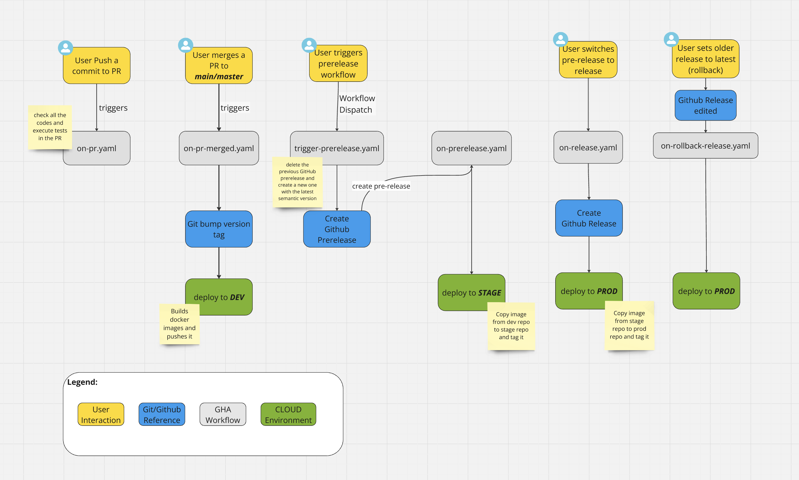

# Trunk-Based CI/CD Flow

A demonstration project showcasing trunk-based development with a complete CI/CD pipeline using GitHub Actions.

## Overview

This project implements a trunk-based development workflow with:
- Automated PR validation and conventional commit enforcement
- Automatic version bumping on merge to main
- Multi-environment deployment (dev → stage → prod)
- Pre-release and release management with changelogs
- Rollback capabilities

## Architecture



## Getting Started

```bash
# Clone the repository
git clone https://github.com/marcodd23/trunk-based-cicd-flow.git

# Install dependencies
go mod download

# Run locally
make build && ./bin/app/app
```

## License

MIT